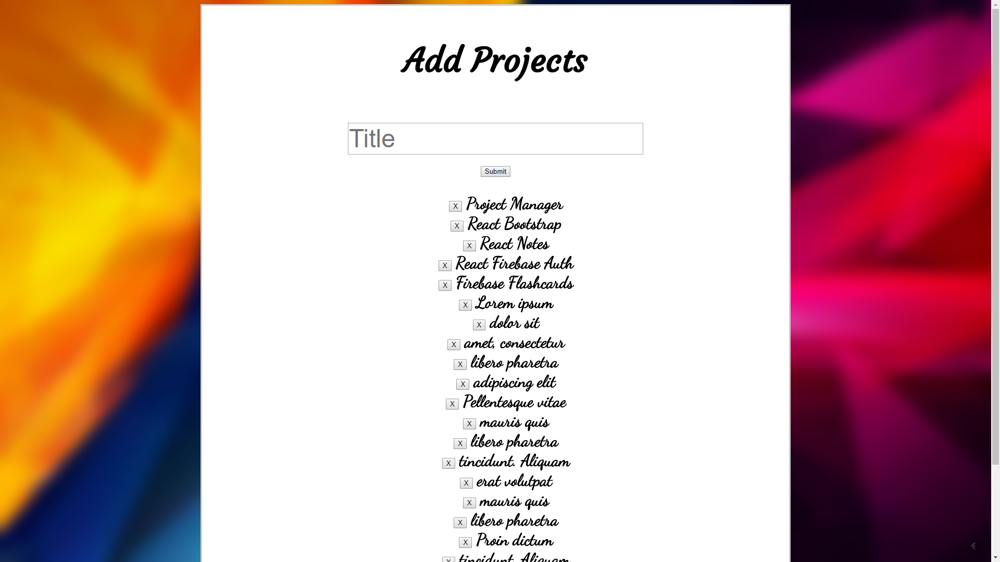

# Project Manager



This project was originally made with the [ReactJS Crash Course](https://www.youtube.com/watch?v=A71aqufiNtQ) by Traversy Media. After I finished the course I wanted to style it better because in the course Brad didn't go over styling at all.

The point of this application was to learn and implement different fundamentals in ReactJS.

## Install and run:
Clone master repository
```sh
git clone 
```

Navigate to projectmanager directory
```sh
cd React-Projects/projectmanager
```

Install all dependencies
```sh
npm install
```

Run app
```sh
npm start
```

## Comment, Questions or Concerns
Email: bobby.pinard@gmail.com