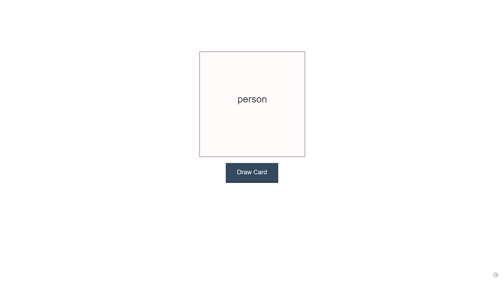

# Firebase Flashcards



This project was originally made with the [React Firebase Flashcards App Tutorial](https://youtu.be/pKCAtlsn1Eo) video by Wes Doyle.

The point of this application was to Create a functional flashcard app using react and Firebase as a backend.

## Install and run:
Clone master repository
```sh
git clone 
```

Navigate to firebase-flashcard directory
```sh
cd React-Projects/firebase-flashcard
```

Install all dependencies
```sh
npm add
```

Run app
```sh
npm start
```

## Comment, Questions or Concerns
Email: bobby.pinard@gmail.com
