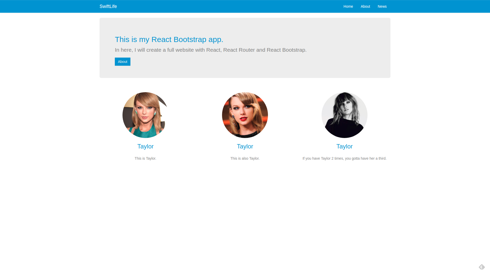

# React Bootstrap



This project was originally made with the [Build a Website with React, React-Bootstrap and React-Router](https://youtu.be/jgVkR5EKI68) video by Brice Ayres.

The point of this application was to Create a site using React and React Bootstrap.

## Install and run:
Clone master repository
```sh
git clone 
```

Navigate to react-bootstrap directory
```sh
cd React-Projects/react-bootstrap
```

Install all dependencies
```sh
yarn install
```

Run app
```sh
yarn start
```

## Comment, Questions or Concerns
Email: bobby.pinard@gmail.com