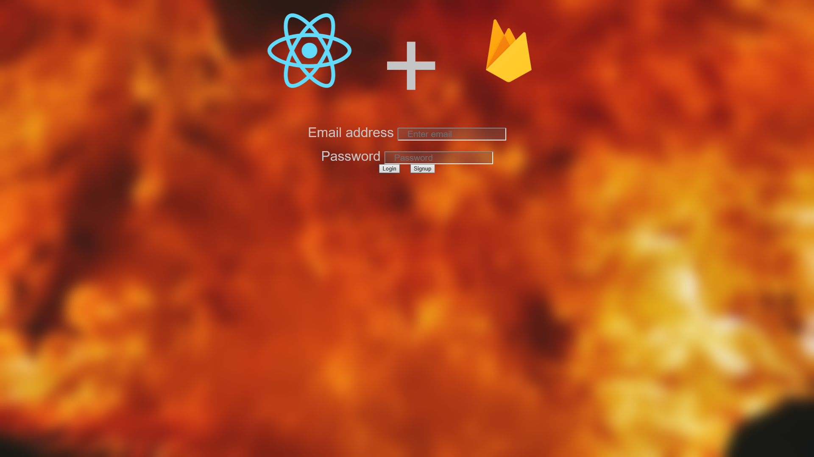

# React Firebase Auth



This project was originally made with the [React Firebase User Login & Signup](https://youtu.be/r4EsP6rovwk) video by Dave Bennett.

The point of this application was to Create a note taking app which used Firebase as a backend to store all the notes. This project is still a work in progress.

## Install and run:
Clone master repository
```sh
git clone 
```

Navigate to react-firebase-auth directory
```sh
cd React-Projects/react-firebase-auth
```

Install all dependencies
```sh
npm add
```

Run app
```sh
npm start
```

## Comment, Questions or Concerns
Email: bobby.pinard@gmail.com
