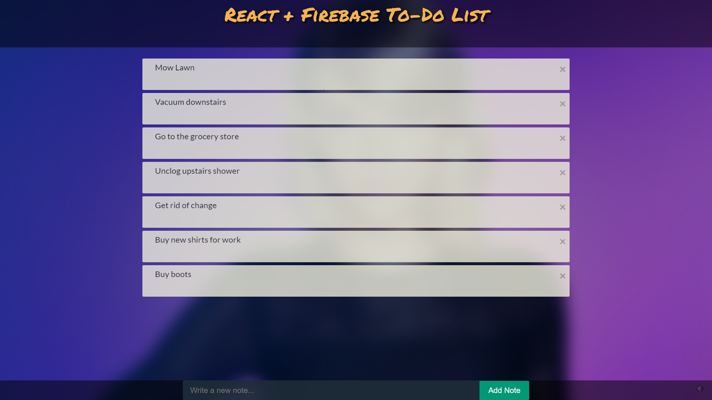

# React Notes



This project was originally made with the [React with Firebase Notes / To-Do App Tutorial](https://youtu.be/-RtJroTMDf4) video by Wes Doyle.

The point of this application was to Create a note taking app which used Firebase as a backend to store all the notes. This project is still a work in progress.

## Install and run:
Clone master repository
```sh
git clone 
```

Navigate to reactnotes directory
```sh
cd React-Projects/reactnotes
```

Install all dependencies
```sh
yarn install
```

Run app
```sh
yarn start
```

## Comment, Questions or Concerns
Email: bobby.pinard@gmail.com